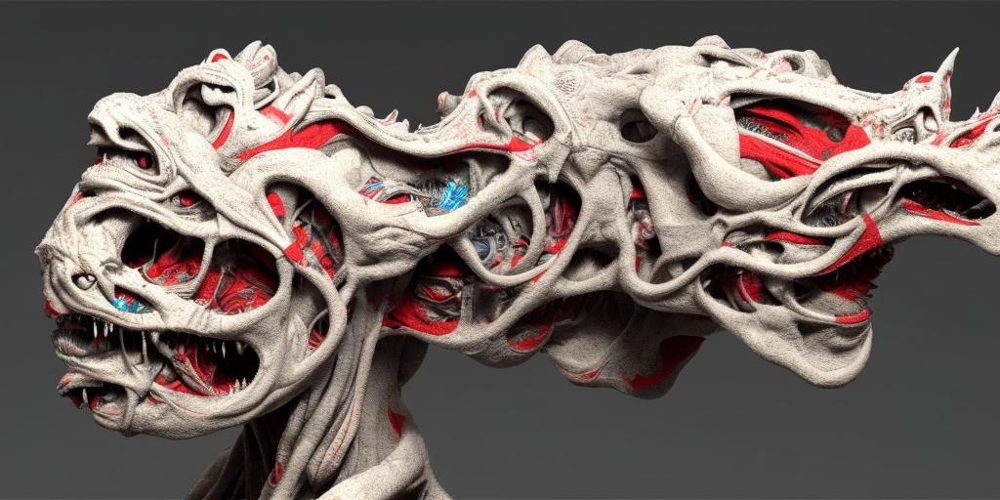

# Stable Diffusion for studies

<p align='center'></p>

This is yet another Stable Diffusion compilation, aimed to be functional, clean & compact enough for various experiments. There's no GUI here, as the target audience are creative coders rather than post-Photoshop users. For the latter one may check [InvokeAI] or [AUTOMATIC1111](https://github.com/AUTOMATIC1111/stable-diffusion-webui) as a convenient production tool, or [Deforum] for precisely controlled animations.  
The code is based on the [CompVis] and [Stability AI] libraries and heavily borrows from [this repo](https://github.com/AmericanPresidentJimmyCarter/stable-diffusion), with occasional additions from [InvokeAI] and [Deforum]. The following codebases are partially included here (to ensure compatibility and the ease of setup): [k-diffusion](https://github.com/crowsonkb/k-diffusion), [Taming Transformers](https://github.com/CompVis/taming-transformers), [OpenCLIP], [CLIPseg].

Current features:
* Text to image
* Image re- and in-painting
* Latent interpolations (with text prompts and images)
* Use of special depth/inpainting and v2 models
* Use of prompt embeddings from [textual inversion]
* Masking with text via [CLIPseg]
* Weighted multi-prompts
* to be continued..  

More details, Colab version and finetuning will follow soon. 

## Setup

Install CUDA 11.6. Setup the Conda environment:
```
conda create -n SD python=3.10 numpy pillow 
activate SD
pip install torch torchvision torchaudio --extra-index-url https://download.pytorch.org/whl/cu116
pip install -r requirements.txt
```
Install `xformers` library to increase performance. It makes possible to run SD in any resolution on the lower grade hardware (e.g. videocards with 6gb VRAM). If you're on Windows, first ensure that you have Visual Studio 2019 installed. 
```
pip install git+https://github.com/facebookresearch/xformers.git
```
Download Stable Diffusion ([1.5](https://huggingface.co/CompVis/stable-diffusion), [1.5-inpaint](https://huggingface.co/runwayml/stable-diffusion-inpainting), [2-inpaint](https://huggingface.co/stabilityai/stable-diffusion-2-inpainting), [2-depth](https://huggingface.co/stabilityai/stable-diffusion-2-depth), [2.1](https://huggingface.co/stabilityai/stable-diffusion-2-1-base), [2.1-v](https://huggingface.co/stabilityai/stable-diffusion-2-1)), [OpenCLIP], [custom VAE](https://huggingface.co/stabilityai/sd-vae-ft-ema-original), [CLIPseg], [MiDaS](https://github.com/isl-org/MiDaS) models (mostly converted to `float16` for faster loading) by the command below. Licensing info is available on their webpages.
```
python download.py
```

## Operations

Examples of usage:

* Generate an image from the text prompt:
```
python src/_sdrun.py -t "hello world" --size 1024-576
```
* Redraw an image with existing style embedding:
```
python src/_sdrun.py -im _in/something.jpg -t "<line-art>"
```
* Redraw directory of images, keeping the basic forms intact:
```
python src/_sdrun.py -im _in/pix -t "neon light glow" --model v2d
```
* Inpaint directory of images with RunwayML model, turning humans into robots:
```
python src/_sdrun.py -im _in/pix --mask "human, person" -t "steampunk robot" --model 15i
```
* Make a video, interpolating between the lines of the text file:
```
python src/latwalk.py -t yourfile.txt --size 1024-576
```
* Same, with drawing over a masked image:
```
python src/latwalk.py -t yourfile.txt -im _in/pix/bench2.jpg --mask _in/pix/mask/bench2_mask.jpg 
```
Other options can be seen by running these scripts with `--help` option.  
Interpolated videos may be further smoothed out with [FILM](https://github.com/google-research/frame-interpolation).  
Text prompts may include [textual inversion] embeddings (e.g. `<depthmap>`) and weights (like `good prompt :1 | also good prompt :1 | bad prompt :-0.5`). The latter may degrade overall accuracy though. 

There are also Windows bat-files, slightly simplifying and automating the commands. 

## Credits

It's quite hard to mention all who made the current revolution in visual creativity possible. Check the inline links above for some of those. 
Huge respect to the people behind [Stable Diffusion], [InvokeAI], [Deforum] and the whole open-source movement.

[Stable Diffusion]: <https://github.com/CompVis/stable-diffusion>
[CompVis]: <https://github.com/CompVis/stable-diffusion>
[Stability AI]: <https://github.com/Stability-AI/stablediffusion>
[InvokeAI]: <https://github.com/invoke-ai/InvokeAI>
[Deforum]: <https://github.com/deforum-art/deforum-stable-diffusion>
[OpenCLIP]: <https://github.com/mlfoundations/open_clip>
[CLIPseg]: <https://github.com/timojl/clipseg>
[textual inversion]: <https://textual-inversion.github.io>
